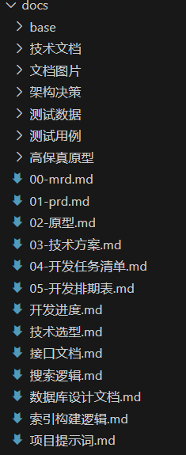
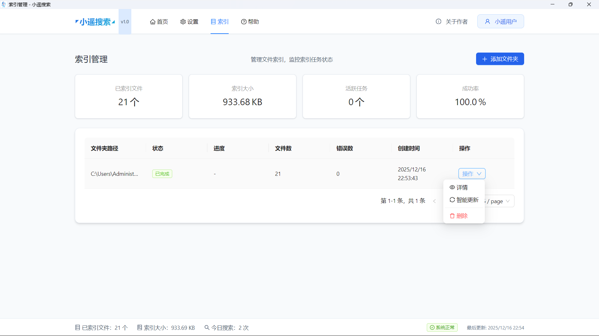
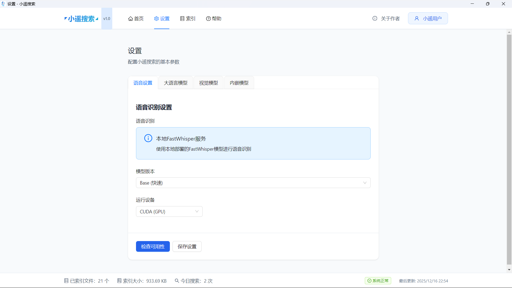
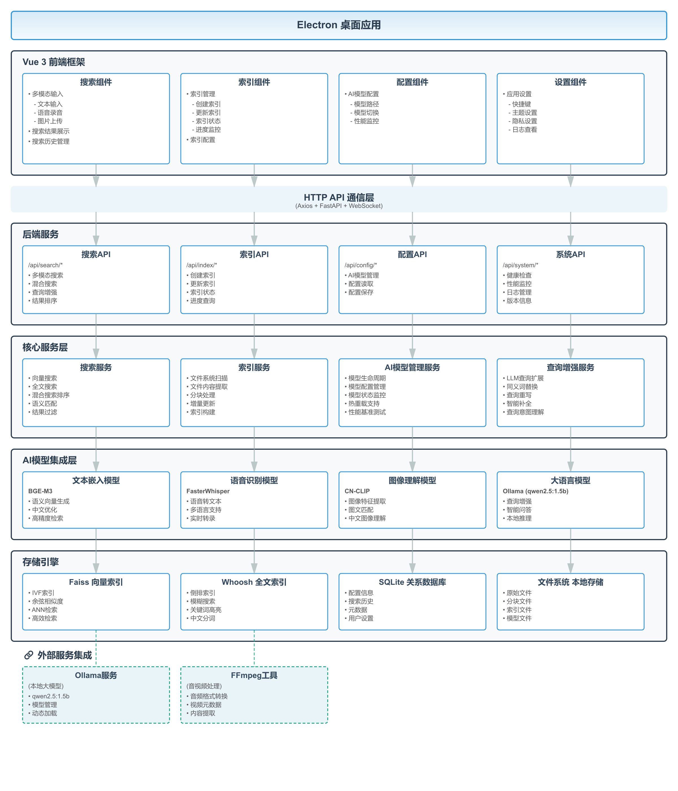

# 小遥搜索 XiaoyaoSearch

[English Version](README_EN.md) | 简体中文


## 📖 项目简介


小遥搜索是一款专为知识工作者、内容创作者和技术开发者设计的跨平台本地桌面应用（Windows/MacOS/Linux）。通过集成的AI模型，支持语音输入（30秒内）、文本输入、图片输入等多种方式，将用户的查询转换为语义进行智能搜索，实现对本地文件的深度检索。

## ⭐️ 重要说明
- 本项目非商业使用完全免费，允许修改和分发（需保留版权声明和协议）；商业目的需授权，详细见[小遥搜索软件授权协议](LICENSE)
- 本项目完全通过Vibe Coding实现，提供所有源码及开发文档（上下文）供大家交流学习
  

## 作者介绍

<p align="center">
  
</p>

<p align="center">
  <b>dtsola</b> — IT架构师 | 一人公司实践者
</p>

<p align="center">
  🌐 <a href="https://www.dtsola.com">个人站点</a> &nbsp;|&nbsp;
  📺 <a href="https://space.bilibili.com/736015">B站</a> &nbsp;|&nbsp;
  💬 微信：dtsola（技术交流 | 商务合作）
</p>

<p align="center">
  
  &nbsp;&nbsp;&nbsp;&nbsp;&nbsp;&nbsp;
  
  &nbsp;&nbsp;&nbsp;&nbsp;&nbsp;&nbsp;
  
</p>

<p align="center">
  <small>微信联系 &nbsp;&nbsp;&nbsp;&nbsp;&nbsp;&nbsp;&nbsp;&nbsp; 开发者交流群 &nbsp;&nbsp;&nbsp;&nbsp;&nbsp;&nbsp;&nbsp;&nbsp; 用户交流群</small>
</p>

### ✨ 核心特性

- **🎤 多模态输入**：支持语音录音、文本输入、图片上传
- **🔍 深度检索**：支持视频（mp4、avi）、音频（mp3、wav）、文档（txt、markdown、office、pdf）的内容和文件名搜索
- **🧠 AI增强**：集成BGE-M3、FasterWhisper、CN-CLIP、OLLAMA等先进AI模型
  - **☁️ 云端大模型**：支持OpenAI/DeepSeek/阿里云等兼容API，与本地模型自由切换（v1.3.0）
  - **☁️ 云端嵌入模型**：支持OpenAI/DeepSeek/阿里云等嵌入API，提升搜索质量（v1.6.0）
- **⚡ 高性能**：基于Faiss向量搜索和Whoosh全文搜索的混合检索架构
- **🔒 隐私可控**：本地运行默认数据不上传，支持云端API选项，性能与隐私权衡由您选择
- **🎨 现代界面**：基于Electron + Vue 3 + TypeScript的现代化桌面应用
- **🤖 AI生态集成**：
  - **MCP 服务器支持**：支持 Model Context Protocol，可被 Claude Desktop 连接进行本地文件智能搜索（v1.4.0）
  - **Agent Skills 支持**：为 Claude Code、VS Code、Cursor 等 AI 助手提供标准化工具调用能力（v1.5.0）

## 📖 核心界面

### 搜索界面

#### 主界面


#### 通过文本搜索


#### 通过语音搜索


#### 通过图片搜索


### 索引管理界面


### 设置界面


## 🏗️ 技术架构

### 系统架构图



### 技术栈

**前端技术**
- **框架**: Electron + Vue 3 + TypeScript
- **UI库**: Ant Design Vue
- **状态管理**: Pinia
- **构建工具**: Vite

**后端技术**
- **框架**: Python 3.10 + FastAPI + Uvicorn
- **AI模型**: BGE-M3 + FasterWhisper + CN-CLIP + Ollama
- **搜索引擎**: Faiss (向量搜索) + Whoosh (全文搜索)
- **数据库**: SQLite + 索引文件

### 项目结构

```
xiaoyaosearch/
├── backend/                        # 后端服务 (Python FastAPI)
│   ├── app/                       # 应用核心代码
│   │   ├── api/                   # API路由层
│   │   ├── core/                  # 核心配置
│   │   ├── models/                # 数据模型
│   │   ├── services/              # 业务服务
│   │   ├── schemas/               # 数据模式
│   │   └── utils/                 # 工具函数
│   ├── requirements.txt           # Python依赖
│   ├── main.py                   # 应用入口
│   └── .env                      # 环境变量
├── frontend/                      # 前端应用 (Electron + Vue3)
│   ├── src/                      # 源代码
│   │   ├── main/                 # Electron主进程
│   │   ├── preload/              # 预加载脚本
│   │   └── renderer/             # Vue渲染进程
│   ├── out/                      # 构建输出
│   ├── dist-electron/            # 打包输出
│   ├── resources/                # 应用资源
│   ├── package.json              # Node.js依赖
│   └── electron-builder.yml      # 打包配置
├── docs/                          # 项目文档
│   ├── 00-mrd.md                  # 市场调研
│   ├── 01-prd.md                  # 产品需求
│   ├── 02-原型.md                 # 产品原型
│   ├── 03-技术方案.md             # 技术方案
│   ├── 04-开发任务清单.md         # 开发任务
│   ├── 05-开发排期表.md           # 开发排期
│   ├── 开发进度.md                # 进度跟踪
│   ├── 接口文档.md                # API文档
│   ├── 数据库设计文档.md          # 数据库设计
│   └── 高保真原型/                # UI原型
├── data/                          # 数据目录
│   ├── database/                  # SQLite数据库
│   ├── indexes/                   # 搜索索引
│   │   ├── faiss/                 # 向量索引
│   │   └── whoosh/                # 全文索引
│   ├── models/                   # 模型文件
│   └── logs/                   # 日志文件
├── .claude/                       # Claude助手配置
├── LICENSE                        # 软件授权协议（中文版）
├── LICENSE_EN                     # 软件授权协议（英文版）
├── README.md                      # 项目说明（中文版）
└── README_EN.md                   # 项目说明（英文版）
```

## 🚀 快速开始

### 方式一：整合包部署（推荐普通用户）

> **适用人群**：非开发者、希望快速体验小遥搜索的用户
> **支持平台**：仅支持 Windows
> **部署难度**：⭐ 简单（一键安装）

#### 下载整合包

从百度网盘下载最新的 Windows 整合包：
- 链接：https://pan.baidu.com/s/1lDaWjMCRXIT-Sqx9UFjerg?pwd=37ed
- 提取码：37ed

请选择最新版本下载（如 `XiaoyaoSearch-Windows-v1.1.1.zip`）

#### 安装步骤

**1. 解压整合包**

将下载的压缩包解压到任意目录（建议不要包含中文路径）

**2. 运行环境准备脚本**

双击运行 `scripts/setup.bat`，脚本会自动完成以下操作：
- 解压 Python 嵌入式运行时
- 安装后端 Python 依赖
- 安装前端 Node 依赖
- 生成配置文件
- 创建数据目录

> **RTX 50 系显卡用户**：如果您使用 RTX 50 系显卡，请运行 `scripts/setup_rtx50显卡.bat`，该脚本会安装支持 CUDA 12.8 的 PyTorch 版本以获得最佳性能。

**3. 安装 Ollama**

双击运行 `runtime\ollama\OllamaSetup.exe`，按提示完成安装。

安装完成后，打开命令行运行：
```bash
ollama serve
ollama pull qwen2.5:1.5b
```

**4. 下载 AI 模型**

从百度网盘下载默认模型：
- 链接：https://pan.baidu.com/s/1jRcTztvjf8aiExUh6oayVg
- 提取码：ycr5

将模型解压到对应目录：
- `data\models\embedding\BAAI\bge-m3\` - 嵌入模型
- `data\models\cn-clip\` - 视觉模型
- `data\models\faster-whisper\` - 语音识别模型

**5. 启动应用**

双击运行 `scripts/startup.bat`，脚本会：
- 启动后端服务
- 启动前端服务

**详细文档**：[整合包部署指南](docs/部署文档/整合包部署指南.md)

---

### 方式二：开发者部署

> **适用人群**：开发者、希望参与项目贡献的用户
> **支持平台**：Windows / macOS / Linux
> **部署难度**：⭐⭐⭐ 需要开发环境

#### 环境要求

- **操作系统**: Windows / macOS / Linux
- **Python**: 3.10.11+（https://www.python.org/downloads/）
- **Node.js**: 21.x+（https://nodejs.org/en/download）
- **内存**: 建议16GB 以上
- **显卡**: 建议RTX3060 6GB以上

#### 安装步骤

**1. 克隆项目**
```bash
git clone https://github.com/dtsola/xiaoyaosearch.git
cd xiaoyaosearch
```

**2. 后端部署**

```shell
# 进入后端目录
cd backend

# 安装依赖包（默认CPU版本的推理引擎）
pip install -r requirements.txt

# 安装faster-whisper
pip install faster-whisper

# 启用CUDA（可选，注意：cuda版本需根据环境确定）
pip uninstall torch torchaudio torchvision

# RTX 40 系及更早显卡（CUDA 12.1）
pip install torch==2.1.0+cu121 torchaudio==2.1.0+cu121 torchvision==0.16.0+cu121 --index-url https://download.pytorch.org/whl/cu121

# RTX 50 系显卡（CUDA 12.8）
pip install torch==2.10.0+cu128 torchaudio==2.10.0+cu128 torchvision==0.25.0+cu128 --index-url https://download.pytorch.org/whl/cu128

```

**安装ffmpeg**:
https://ffmpeg.org/download.html

**安装ollama**:
https://ollama.com/

**配置 `.env` 文件**:
```env

# 数据配置
FAISS_INDEX_PATH=../data/indexes/faiss
WHOOSH_INDEX_PATH=../data/indexes/whoosh
DATABASE_PATH=../data/database/xiaoyao_search.db

# API配置
API_HOST=127.0.0.1
API_PORT=8000
API_RELOAD=true

# 日志配置
LOG_LEVEL=info
LOG_FILE=../data/logs/app.log
```

**准备模型**:
系统默认模型说明：
- ollama：qwen2.5:1.5b
- 嵌入模型：BAAI/bge-m3
- 语音识别模型：Systran/faster-whisper-base
- 视觉模型：OFA-Sys/chinese-clip-vit-base-patch16

注意：建议先准备默认模型，先成功启动应用后，再更换模型。

ollama模型：
ollama pull qwen2.5:1.5b （根据情况自行选择）

所有模型下载地址：（百度盘）
链接: https://pan.baidu.com/s/1jRcTztvjf8aiExUh6oayVg?pwd=ycr5 提取码: ycr5 

嵌入模型：
- 模型根目录：data/models/embedding
- 将下载的模型直接解压放入到根目录即可，以下是对应关系
  - data/models/embedding/BAAI/bge-m3
  - data/models/embedding/BAAI/bge-small-zh
  - data/models/embedding/BAAI/bge-large-zh

语音识别模型：
- 模型根目录：data/models/faster-whisper
- 将下载的模型直接解压放入到根目录即可，以下是对应关系
  - data/models/faster-whisper/Systran/faster-whisper-base
  - data/models/faster-whisper/Systran/faster-whisper-small
  - data/models/faster-whisper/Systran/faster-whisper-medium
  - data/models/faster-whisper/Systran/faster-whisper-large-v3

视觉模型：
- 模型根目录：data/models/cn-clip
- 将下载的模型直接解压放入到根目录即可，以下是对应关系
  - data/models/cn-clip/OFA-Sys/chinese-clip-vit-base-patch16
  - data/models/cn-clip/OFA-Sys/chinese-clip-vit-large-patch14


**启动后端服务**:
```shell
# 使用内置配置启动
python main.py

# 或使用uvicorn启动
uvicorn main:app --host 127.0.0.1 --port 8000 --reload
```

#### 3. 前端部署

```shell
# 进入前端目录
cd frontend

# 安装依赖
npm install

# 启动开发服务器
npm run dev
```

---

## 🔄 版本升级指南

当需要升级到新版本时，请参考 [版本升级指南](docs/技术文档/版本升级指南.md)，轻松保留您的索引数据和配置。

---

## 🤝 如何共享代码

感谢你对小遥搜索的关注！我们欢迎任何形式的贡献，无论是代码、文档、Bug 修复还是新功能建议。

### 贡献方式

#### 方式一：提交 Pull Request（推荐）

**步骤 1：Fork 项目**
1. 访问 [xiaoyaosearch](https://github.com/dtsola/xiaoyaosearch) 仓库
2. 点击右上角的 "Fork" 按钮，将项目 Fork 到你的 GitHub 账户

**步骤 2：克隆到本地**
```bash
git clone https://github.com/<你的用户名>/xiaoyaosearch.git
cd xiaoyaosearch
```

**步骤 3：创建功能分支**
```bash
git checkout -b feature/你的功能名称
# 或
git checkout -b fix/问题描述
```

**步骤 4：进行开发**
- 按照项目代码规范进行开发
- 确保代码有适当的注释
- 运行测试确保功能正常

**步骤 5：提交代码**
```bash
git add .
git commit -m "feat(scope): 简洁描述你的改动"
```
提交格式规范：
- `feat`: 新功能
- `fix`: Bug 修复
- `docs`: 文档更新
- `style`: 代码格式调整
- `refactor`: 代码重构
- `perf`: 性能优化
- `test`: 测试相关
- `chore`: 构建/工具链相关

**步骤 6：推送到 GitHub**
```bash
git push origin feature/你的功能名称
```

**步骤 7：创建 Pull Request**
1. 访问你 Fork 的仓库页面
2. 点击 "Compare & pull request" 按钮
3. 填写 PR 描述：
   - 标题：简洁说明改动内容
   - 描述：详细说明改动原因、实现方式、测试结果
4. 等待维护者审核

#### 方式二：提交 Issue

如果你发现了 Bug 或有功能建议：
1. 访问 [Issues](https://github.com/dtsola/xiaoyaosearch/issues) 页面
2. 点击 "New Issue"
3. 选择合适的 Issue 模板
4. 详细描述问题或建议

### 代码规范

#### 前端规范
- 组件命名：PascalCase（如 `SearchPanel.vue`）
- 变量/函数：camelCase（如 `searchResults`）
- 常量：UPPER_SNAKE_CASE（如 `MAX_FILE_SIZE`）
- 代码注释：使用中文

#### 后端规范
- 文件命名：snake_case（如 `search_service.py`）
- 类名：PascalCase（如 `SearchService`）
- 函数/变量：snake_case（如 `search_files`）
- 常量：UPPER_SNAKE_CASE（如 `MAX_RESULTS`）
- 代码注释：使用中文

### 贡献指南

- ✅ 遵循项目的代码规范
- ✅ 保持代码简洁，避免过度设计
- ✅ 添加适当的错误处理
- ✅ 确保代码有适当的测试
- ✅ 更新相关文档

### 获取帮助

- 💬 微信：dtsola（请备注 "小遥搜索贡献"）
- 📧 邮件：通过官网 https://www.dtsola.com 联系
- 📺 B站：https://space.bilibili.com/736015

### 贡献者权益

- 📝 你的名字将出现在项目贡献者列表中
- 🌟 你的改动将帮助成千上万的用户
- 🤝 加入独立开发者社区，交流学习
- 🎁 优秀贡献者可获得项目周边礼品

---

**让我们一起打造更好的本地搜索体验！** 🚀

## 产品路线图
[产品路线图](ROADMAP.md)

## 数据源插件列表

小遥搜索支持**插件化架构**，可通过插件扩展多种数据源：

### 支持的数据源类型

| 类型 | 说明 | 状态 |
|------|------|------|
| 📁 本地文件 | 系统内置，无需配置 | ✅ 已实现 |
| ☁️ 语雀 | 阿里语雀知识库 | ✅ 已实现 |
| ☁️ 飞书 | 飞书文档 | 📋 计划中 |
| ☁️ Notion | Notion 笔记 | 📋 计划中 |
| 🔗 GitHub | 代码仓库和 Wiki | 📋 计划中 |
| 🔗 GitLab | GitLab 代码仓库 | 📋 计划中 |

### 完整列表

查看完整的数据源插件列表（13种类型）：

**📖 [数据源插件列表](docs/技术文档/数据源插件列表.md)** | [English Version](docs/技术文档/数据源插件列表_EN.md)

### 开发插件

想要开发新的数据源插件？

**📖 [插件开发文档](docs/技术文档/插件开发文档.md)**

---

## 🔥 MCP 服务器支持

小遥搜索现已支持 **Model Context Protocol (MCP)**，可被 Claude Desktop 等 AI 应用连接，进行本地文件智能搜索。

### 什么是 MCP？

MCP (Model Context Protocol) 是 Anthropic 推出的开源协议，允许 AI 应用（如 Claude Desktop）连接到本地数据源。通过 MCP，Claude 可以直接搜索和访问您的本地文件，提供更智能的问答和帮助。

### Agent Skills 支持

小遥搜索现已支持 **Agent Skills**，为 Claude Code、VS Code、Cursor 等 AI 助手提供标准化的 MCP 工具调用能力。

**安装 Skill**：

```bash
# 项目级别
cp -r skills/ .claude/skills/

# 或全局级别
cp -r skills/ ~/.claude/skills/
```

安装后，AI 助手可自动发现小遥搜索的 MCP 工具，并提供正确使用指导。

### MCP 客户端配置

小遥搜索 MCP 服务器使用 **HTTP 传输协议**，任何支持 HTTP MCP 的客户端都可以连接。

#### Claude Code CLI 配置

官方命令行工具，快速配置：

```bash
# 添加 HTTP MCP 服务器
claude mcp add --transport http xiaoyao-search http://127.0.0.1:8000/mcp

# 检查 MCP 是否添加成功（确保 MCP 已经启动的前提下，运行下面命令）
claude mcp list
```

#### 其他支持 MCP 的客户端

任何支持 MCP 协议的客户端都可以连接到：`http://127.0.0.1:8000/mcp`

**基本配置模板**：

```json
{
  "name": "xiaoyao-search",
  "url": "http://127.0.0.1:8000/mcp",
  "type": "sse"
}
```

**常用客户端配置示例**：

- **Cline (VSCode 插件)**: 在 VSCode 设置中搜索 `cline.mcpServers`，添加上述配置
- **Cursor**: 在 Cursor 设置的 MCP 服务器配置中添加上述配置
- **其他 MCP 客户端**: 参考客户端文档，使用 SSE 传输方式连接

### 支持的搜索工具

| 工具名称 | 说明 | AI 模型 |
|---------|------|---------|
| semantic_search | 语义搜索，支持自然语言查询理解 | BGE-M3 |
| fulltext_search | 全文搜索，支持精确关键词匹配和中文分词 | Whoosh |
| voice_search | 语音搜索，支持语音输入转文本后搜索 | FasterWhisper |
| image_search | 图像搜索，支持图片上传查找相似内容 | CN-CLIP |
| hybrid_search | 混合搜索，结合语义和全文搜索的优势 | BGE-M3 + Whoosh |

### 使用示例

配置完成后，您可以在 Claude Desktop 中进行以下操作：

**语义搜索**：
```
用户：帮我找一下关于异步编程的文档
Claude：[调用 semantic_search 工具] 找到 5 个相关文档...
```

**全文搜索**：
```
用户：搜索包含 "async def" 的代码文件
Claude：[调用 fulltext_search 工具] 找到 3 个代码文件...
```

**图像搜索**：
```
用户：[上传图片] 找找类似的图表
Claude：[调用 image_search 工具] 找到 2 个相似的图表...
```

### 验证 MCP 连接

访问健康检查端点验证 MCP 服务状态：
```bash
curl http://127.0.0.1:8000/mcp/health
```

返回示例：
```json
{
  "status": "enabled",
  "server": "fastmcp",
  "tools_count": 5,
  "tools": ["semantic_search", "fulltext_search", "voice_search", "image_search", "hybrid_search"]
}
```

### 配置选项

在 `backend/.env` 中配置 MCP 服务：

```bash
# MCP 服务器配置
MCP_SSE_ENABLED=true              # 是否启用 MCP SSE 服务
MCP_SERVER_NAME=xiaoyao-search    # 服务器名称
MCP_DEFAULT_LIMIT=20              # 默认结果数量
MCP_DEFAULT_THRESHOLD=0.5         # 默认相似度阈值
MCP_VOICE_ENABLED=true            # 是否启用语音搜索
```

### 技术实现

- **协议实现**：使用 [fastmcp](https://github.com/PrefectHQ/fastmcp) 框架
- **传输方式**：HTTP SSE (Server-Sent Events)
- **架构模式**：FastAPI 集成，共享 AI 模型和搜索服务
- **内存优化**：单一进程，模型只加载一次，节省 4-6GB 内存

### 详细文档

- [MCP PRD](docs/特性开发/mcp/mcp-01-prd.md) - 产品需求文档
- [MCP 技术方案](docs/特性开发/mcp/mcp-03-技术方案.md) - 技术实现方案
- [MCP 官方文档](https://modelcontextprotocol.io/) - MCP 协议规范

---

## 项目贡献者
感谢以下人员为本项目做出的贡献：
- [@jidingliu](https://github.com/jidingliu) - 提交代码及项目宣传